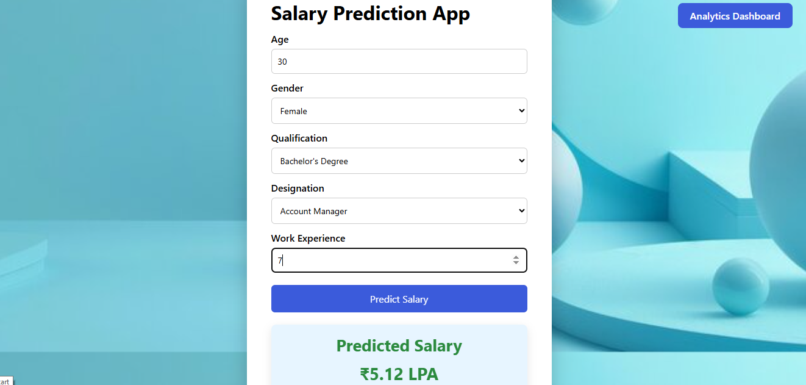
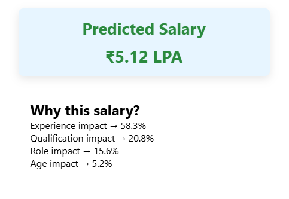
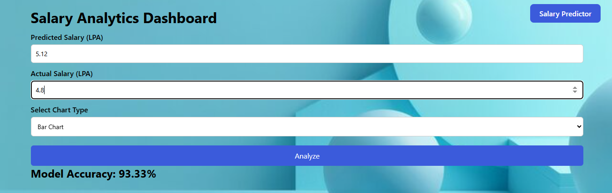
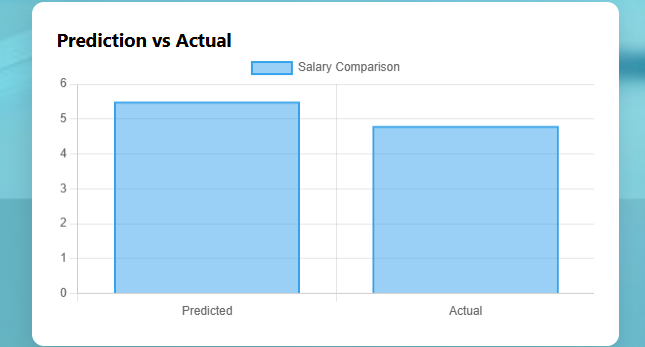
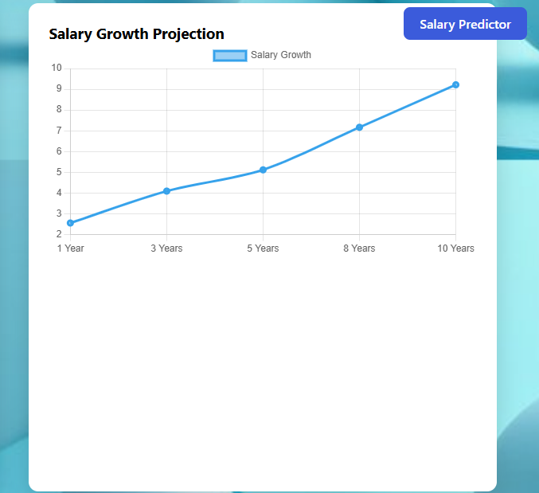
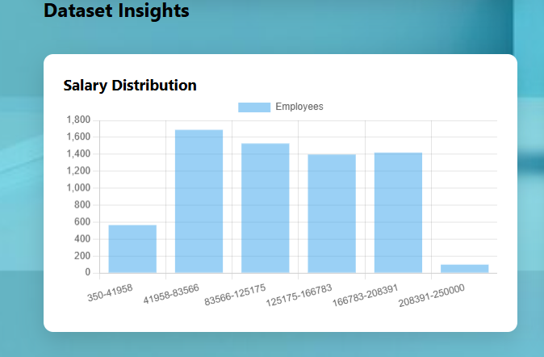
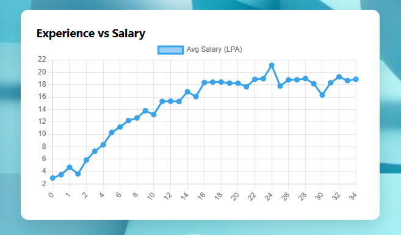
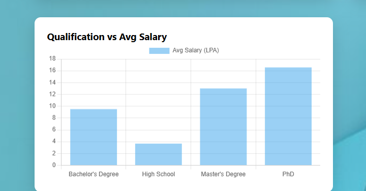

<p align="center">

# Salary Prediction AI

Machine Learning Web Application for predicting salaries using experience, qualification, and job role.

</p>

<p align="center">


</p>

<p align="center">


</p>

---

# About the Project

This project is a **Machine Learning salary prediction system** built with **Python, Flask, and Scikit-Learn**.

The web application allows users to:

* Predict salary using ML
* Understand **why the salary was predicted**
* Compare **predicted vs actual salary**
* Analyze **model accuracy**
* Explore **dataset insights using charts**

---

# Author

**Himanshu Giri**

GitHub
https://github.com/Himanshu-029

---

# Features

## Salary Predictor

Predict salary based on:

* Age
* Gender
* Qualification
* Job Designation
* Work Experience

---

## AI Explanation

Shows how different features influenced the prediction:

* Experience impact
* Qualification impact
* Role impact
* Age impact

---

## Analytics Dashboard

The dashboard provides:

* Predicted vs Actual Salary Comparison
* Model Accuracy
* Salary Growth Projection

---

## Dataset Insights

Interactive charts from the dataset:

* Salary Distribution
* Experience vs Salary
* Qualification vs Average Salary

---

# Application Screenshots

## Home Page


---

## Salary Prediction



---

## AI Explanation



---

## Analytics Dashboard



---

## Salary Comparison



---

## Salary Growth Projection



---

## Dataset Insights

### Salary Distribution



### Experience vs Salary



### Qualification vs Average Salary



---

# Tech Stack

### Backend

* Python
* Flask
* Scikit-learn

### Data Processing

* Pandas
* NumPy

### Frontend

* HTML
* CSS
* Chart.js

---

# Project Structure

```
salary-prediction-ml
│
├── app.py
├── Salary_Data.csv
├── salary_prediction_model.pkl
├── model_columns.pkl
│
├── templates
│   ├── home.html
│   ├── predict.html
│   └── analytics.html
│
├── static
│   ├── style.css
│   ├── hero-bg.jpg
│   └── salary.png
│
├── screenshots
│   ├── home.png
│   ├── predictor.png
│   ├── explanation.png
│   ├── analytics.png
│   ├── comparison.png
│   ├── growth.png
│   ├── distribution.png
│   ├── experience.png
│   └── qualification.png
│
└── salary_prediction.ipynb
```

---

# Installation

Clone the repository

```
git clone https://github.com/Himanshu-029/salary-prediction-ml.git
```

Navigate to project folder

```
cd salary-prediction-ml
```

Install dependencies

```
pip install flask pandas numpy scikit-learn
```

Run the application

```
python app.py
```

Open in browser

```
http://127.0.0.1:5000
```

---

# Future Improvements

* Deploy the application online
* Improve model accuracy
* Add API endpoints
* Add real-time salary data
* Improve dashboard UI

---

# License

This project is for **educational and portfolio purposes**.

---

⭐ If you like this project, consider starring the repository.
