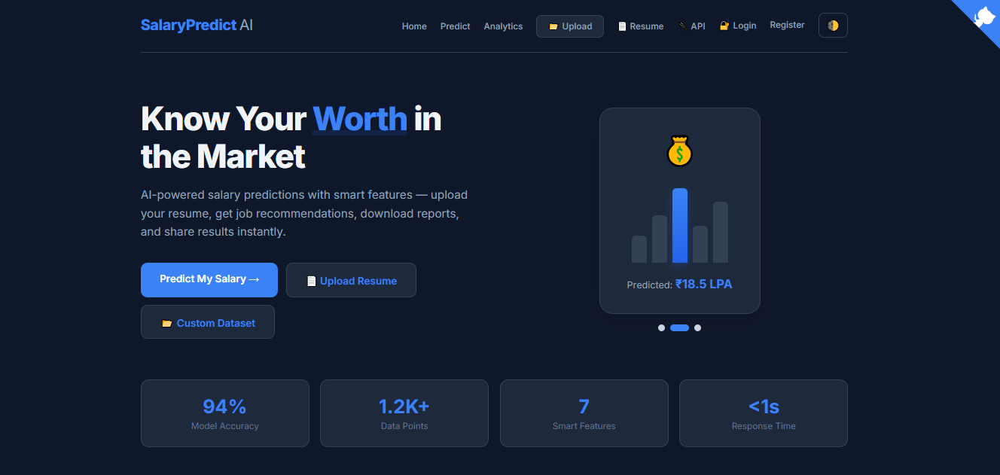
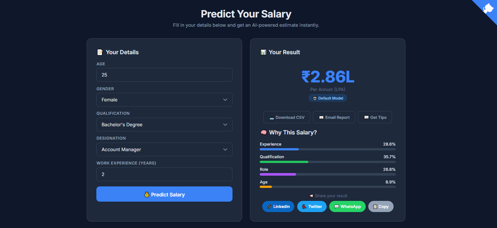
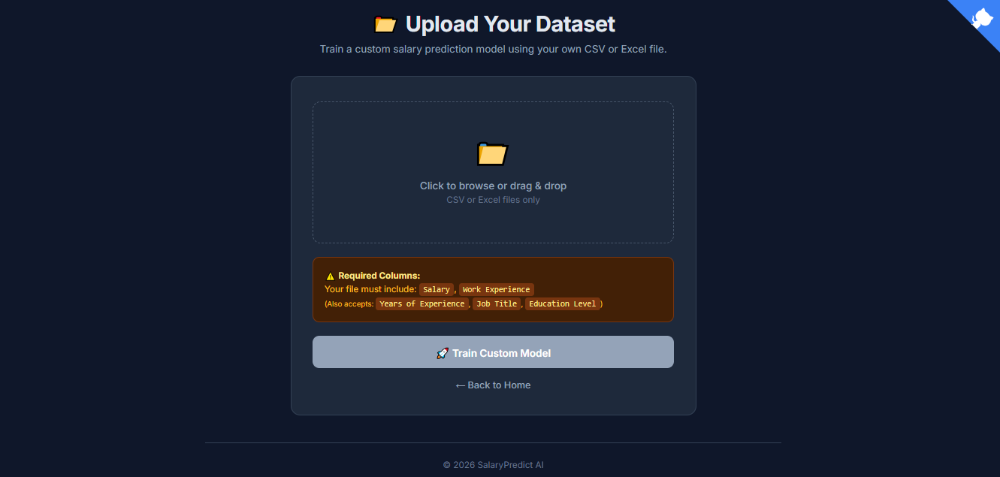
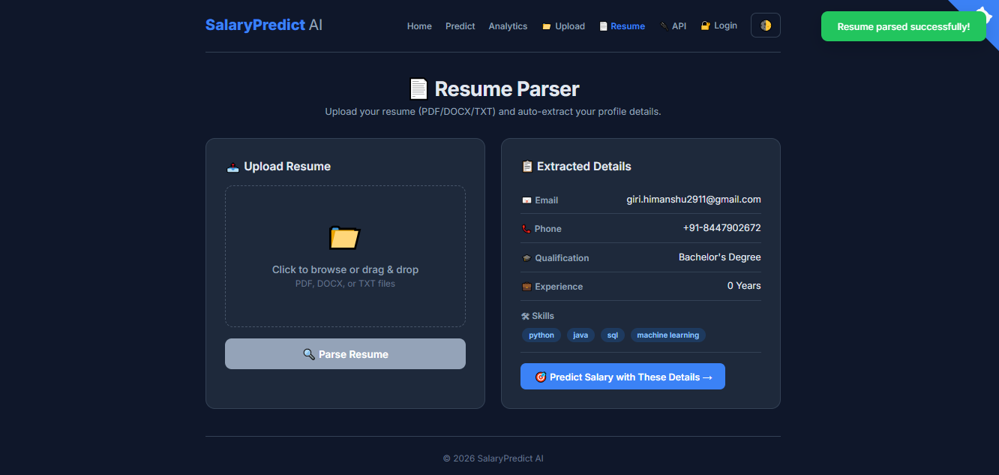
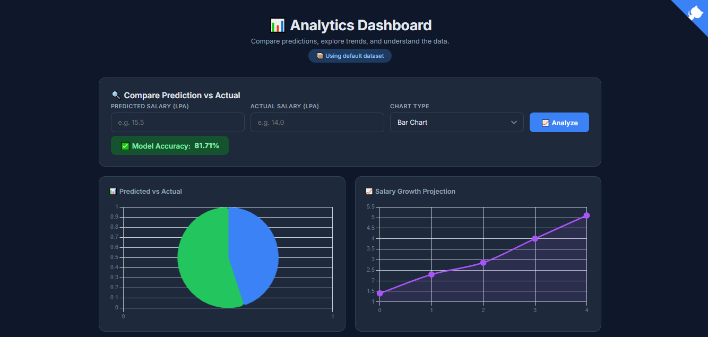
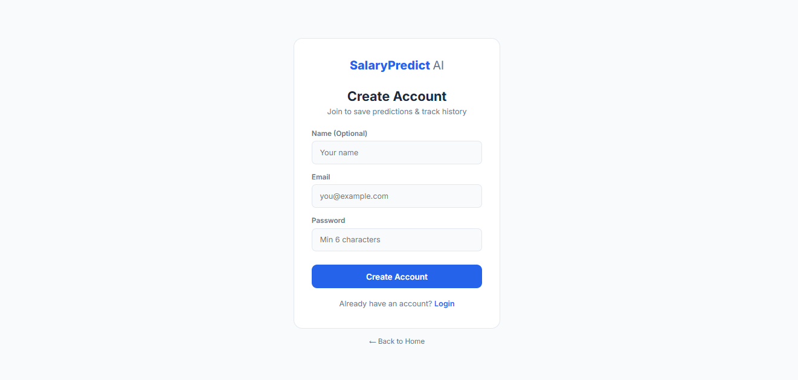
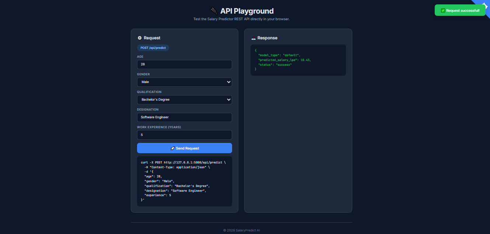
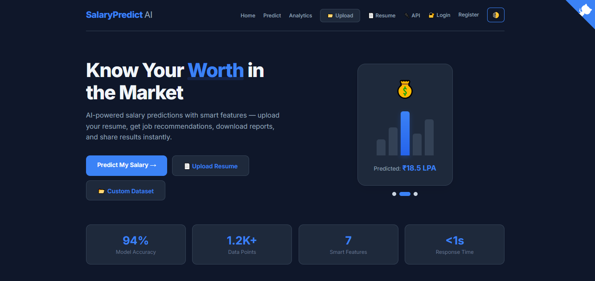

<p align="center">
  <h1 align="center">💸 SalaryPredict AI</h1>
  <p align="center">
    <strong>AI-Powered Salary Prediction Platform with Modern UI, Resume Parsing & REST API</strong>
  </p>
</p>

<p align="center">
  
  
  
  
  
  
  
  
</p>

---

## 📖 Table of Contents

- [About](#-about)
- [Features](#-features)
- [Tech Stack](#-tech-stack)
- [Project Structure](#-project-structure)
- [Installation](#-installation)
- [Usage Guide](#-usage-guide)
- [API Reference](#-api-reference)
- [Screenshots](#-screenshots)
- [Future Roadmap](#-future-roadmap)
- [Author](#-author)

---

## 🚀 About

**SalaryPredict AI** is a full-stack Machine Learning web application that predicts salaries based on user profiles. Built with Flask and Scikit-learn, it features a modern Minimalist Scandinavian UI with dark mode, user authentication, resume parsing, job role recommendations, and a fully functional REST API.

### What You Can Do:
- 🎯 **Predict salary** using ML regression models
- 🧠 **Understand predictions** with AI explanation breakdowns
- 📊 **Analyze data** with interactive Chart.js dashboards
- 📄 **Upload resumes** (PDF/DOCX/TXT) for auto profile extraction
- 📁 **Upload custom datasets** to train session-based models
- 💬 **Get negotiation tips** based on your predicted salary
- 📧 **Email reports** to yourself (simulated)
- 🔌 **Test the API** with an in-browser playground
- 🌓 **Toggle dark/light mode** with persistence
- 📱 **Fully responsive** across all devices

---

## ✨ Features

| Category | Feature | Description |
|----------|---------|-------------|
| 🤖 **ML Engine** | Salary Prediction | Linear Regression model trained on real salary data |
| | Custom Model Training | Upload CSV/Excel to train a temporary session model |
| | AI Explanation | Visual breakdown of factors influencing prediction |
| 🧑‍💻 **User System** | Authentication | Register/Login with SQLite-backed accounts |
| | Prediction History | View past predictions with trend charts |
| 📄 **Resume Parser** | PDF/DOCX/TXT Support | Auto-extract email, phone, skills, experience |
| | Skill Detection | Identifies 12+ technical skills from resume text |
| 🎯 **Recommendations** | Job Role Matching | Suggests top 3 roles with match percentages |
| 💬 **Negotiation** | Personalized Tips | Rule-based advice based on salary bracket & experience |
| 📊 **Analytics** | 5 Interactive Charts | Distribution, trends, growth projections |
| | Model Accuracy | Compare predicted vs actual salary |
| 🔌 **Developer** | REST API | JSON endpoint at `POST /api/predict` |
| | API Playground | In-browser testing with live cURL generation |
| | CSV Export | Download predictions as CSV reports |
| 🎨 **UI/UX** | Minimalist Scandinavian | Clean design with Inter font & soft shadows |
| | Dark Mode | Toggle with localStorage persistence |
| | Toast Notifications | Auto-dismissing status messages |
| | Loading Spinner | Visual feedback during predictions |
| | Confetti Animation | Celebration on high salary predictions |
| | Social Share | LinkedIn, Twitter, WhatsApp, Copy buttons |
| | Keyboard Shortcut | `Ctrl+Enter` to submit form |
| | GitHub Ribbon | Fixed corner link to repository |

---

## 🛠 Tech Stack

| Layer | Technology |
|-------|-----------|
| **Backend** | Python 3.11+, Flask |
| **ML Library** | Scikit-learn (Linear Regression) |
| **Data Processing** | Pandas, NumPy |
| **Database** | SQLite3 |
| **Resume Parsing** | PyPDF2, python-docx |
| **Frontend** | HTML5, CSS3 (CSS Variables), JavaScript |
| **Charts** | Chart.js 4.x |
| **Confetti** | canvas-confetti |
| **Fonts** | Inter (UI), JetBrains Mono (Code) |
| **Design System** | Minimalist Scandinavian |

---

## 📁 Project Structure

```
Salary-Prediction-App/
│
├── app.py                          # Main Flask application
├── Salary_Data.csv                 # Default training dataset
├── salary_prediction_model.pkl     # Pre-trained model
├── model_columns.pkl               # Feature columns reference
├── database.db                     # SQLite user & history database
├── requirements.txt                # Python dependencies
├── README.md                       # Project documentation
│
├── templates/
│   ├── home.html                   # Landing page with hero & features
│   ├── predict.html                # Salary prediction form & results
│   ├── analytics.html              # Charts dashboard
│   ├── upload.html                 # Custom dataset upload
│   ├── resume.html                 # Resume parser upload & results
│   ├── history.html                # User prediction history
│   ├── email_report.html           # Email report form & preview
│   ├── negotiation_tips.html       # Salary negotiation advice
│   ├── api_playground.html         # Live API testing interface
│   ├── register.html               # User registration
│   └── login.html                  # User login
│
├── uploads/                        # Uploaded dataset storage
├── resumes/                        # Uploaded resume storage
│
└── screenshots/                    # Application screenshots
    ├── home.png
    ├── predict.png
    ├── analytics.png
    ├── resume.png
    ├── api.png
    └── darkmode.png
```

---

## ⚙️ Installation

### Prerequisites
- Python 3.8 or higher
- pip (Python package manager)

### Step 1: Clone the Repository
```bash
git clone https://github.com/Himanshu-029/Salary-Prediction-App.git
cd Salary-Prediction-App
```

### Step 2: Install Dependencies
```bash
pip install -r requirements.txt
```

<details>
<summary>Or install manually</summary>

```bash
pip install flask pandas numpy scikit-learn PyPDF2 python-docx openpyxl
```
</details>

### Step 3: Run the Application
```bash
python app.py
```

### Step 4: Open in Browser
```
http://127.0.0.1:5000
```

---

## 📖 Usage Guide

### 1. Home 
Go to `/home`, and check out an AI-powered salary prediction platform that analyzes skills, experience, and resume parsing, instant predictions, career insights, and interactive analytics in a modern web interface.



### 2. Predict Salary
Navigate to `/predict`, fill in your details (Age, Gender, Qualification, Designation, Experience), and click "Predict Salary". You'll see the predicted amount, AI explanation bars, job recommendations, and social share buttons.



### 3. Upload Custom Dataset
Go to `/upload`, drop a CSV/Excel file with columns like Salary, Work Experience, Age, etc. The app trains a temporary model and switches all predictions to use your data.



### 4. Parse Your Resume
Visit `/resume`, upload your PDF/DOCX/TXT resume. The parser extracts your email, phone, skills, experience years, and qualification — then links directly to the predictor.



### 5. View Analytics
Head to `/analytics` to compare predicted vs actual salaries, explore salary distributions, and analyze trends with interactive charts.



### 6. Create an Account
Register at `/register` to save your prediction history. Login to view past predictions with trend charts on `/history`.



### 7. Test the API
Open `/api_playground` to send live requests to `POST /api/predict` and see JSON responses. The cURL command updates automatically.



### 8. Toggle Dark Mode
Click the 🌓 icon in the navbar. Your preference is saved across sessions.



---

## 🔌 API Reference

### `POST /api/predict`

Predict salary from JSON input.

**Request Body:**
```json
{
  "age": 28,
  "gender": "Male",
  "qualification": "Bachelor's Degree",
  "designation": "Software Engineer",
  "experience": 5
}
```

**Success Response (200):**
```json
{
  "status": "success",
  "predicted_salary_lpa": 12.5,
  "model_type": "default"
}
```

**cURL Example:**
```bash
curl -X POST http://127.0.0.1:5000/api/predict \
  -H "Content-Type: application/json" \
  -d '{"age":28,"gender":"Male","qualification":"Bachelor'\''s Degree","designation":"Software Engineer","experience":5}'
```

---

## 📸 Screenshots

| Page | Preview |
|------|---------|
| Home | Landing page with hero, stats & features |
| Predict | Salary prediction form, results & AI explanation |
| Analytics | 5 interactive Chart.js dashboards |
| Resume Parser | Upload & auto-extract profile details |
| API Playground | Live API testing with cURL generation |
| Dark Mode | Full dark theme across all pages |

---

## 🔮 Future Roadmap

- [ ] Deploy to cloud (Render + Vercel)
- [ ] Flask-Mail integration for real email sending
- [ ] OAuth login (Google, GitHub)
- [ ] Advanced ML models (XGBoost, Random Forest)
- [ ] Company/Industry salary benchmarks
- [ ] Admin panel for model management
- [ ] Mobile PWA support
- [ ] Multi-language support

---

## 🤝 Contributing

Contributions are welcome! Here's how:

1. Fork the repository
2. Create a feature branch: `git checkout -b feature/amazing-feature`
3. Commit your changes: `git commit -m 'Add amazing feature'`
4. Push to the branch: `git push origin feature/amazing-feature`
5. Open a Pull Request

Please ensure your code follows the existing style and includes appropriate comments.

---

## 📄 License

This project is licensed under the **MIT License** — feel free to use, modify, and distribute it for personal or commercial purposes.

---

## 👨‍💻 Author

**Himanshu Giri**

- GitHub: [@Himanshu-029](https://github.com/Himanshu-029)
- Project Link: [Salary-Prediction-App](https://github.com/Himanshu-029/Salary-Prediction-App)

---

<p align="center">
  <strong>⭐ If you find this project useful, please consider giving it a star!</strong>
</p>

<p align="center">
  Built with ❤️ using Python, Flask & Scikit-learn
</p>
